# TANDA CHALLENGE
This challenge is to create a highly simplified version of the Tanda web app from scratch using Ruby on Rails, Javascript and PostgreSQL.  

---

## Teck Stack
* Ruby on Rails - backend
* ReactJs - Frontend 
* PostgreSQL - database  

---

## Deployment and Hosting
- Api hosted deployed and Hosted on Heroku
- Client hosted and deployed on Netlify  

---

## WEBSITE  https://tanda.netlify.app/  

---

## REPO Backend API - https://github.com/Kryptic2020/Tanda-API    
--- 
## REPO Client - https://github.com/Kryptic2020/Tanda-Client    
---

## Third party APIs
* Sendgrid Email API  
---

## Management tools and Metodology
* Git & Github with more than 30commits, +8 branchs
* Agile - short sprints
* Trello cards 
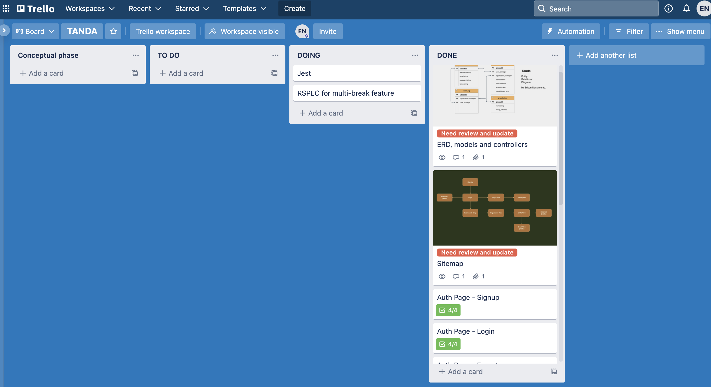  

---

## Testing
* RSPEC 
* JEST  

---

## Frameworks, gems and Packages
* Figaro
* Bcrypt
* Knock
* Bootstrap
* Styled Component
* "@date-io/date-fns": "^2.11.0",
* "@emotion/react": "^11.7.0",
* "@emotion/styled": "^11.6.0",
* "@mui/icons-material": "^5.2.0",
* "@mui/lab": "^5.0.0-alpha.57",
* "@mui/material": "^5.2.1",
* "@testing-library/jest-dom": "^5.11.4",
* "@testing-library/react": "^11.1.0",
* "@testing-library/user-event": "^12.1.10",
* "axios": "^0.24.0",
* "bootstrap": "^5.1.3",
* "date-fns": "^2.26.0",
* "react": "^17.0.2",
* "react-bootstrap": "^2.0.2",
* "react-datepicker": "^4.3.0",
* "react-dom": "^17.0.2",
* "react-router-dom": "^5.2.0",
* "react-scripts": "4.0.3",
* "styled-components": "^5.3.3",
* "web-vitals": "^1.0.1"  

---

## Tanda Sitemap  

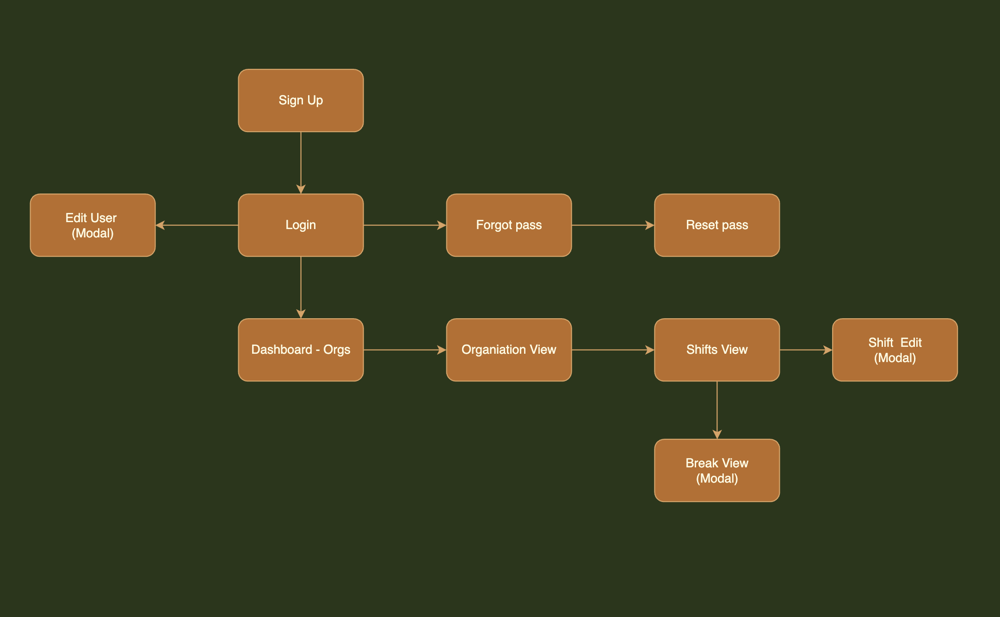  

---

## Tanda ERD  

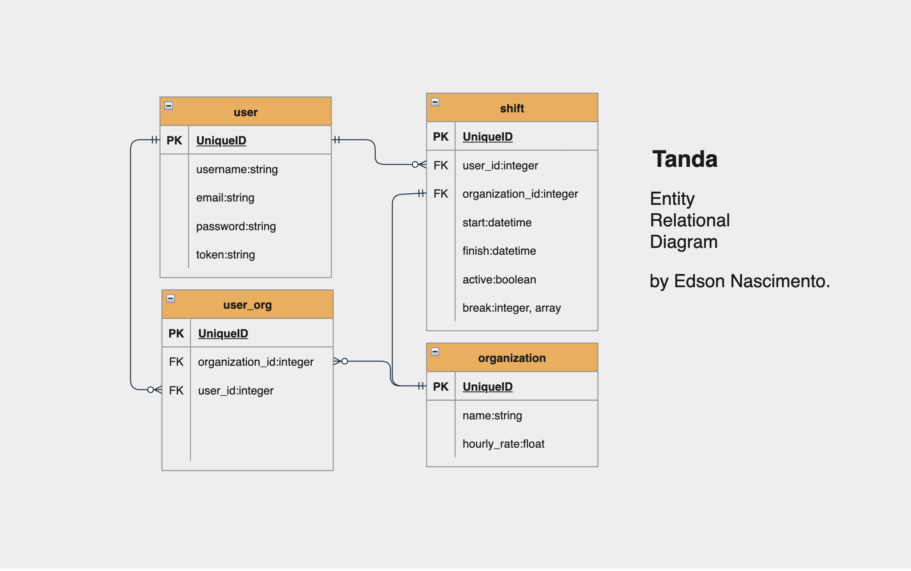    

---

## Tanda Screen shots  

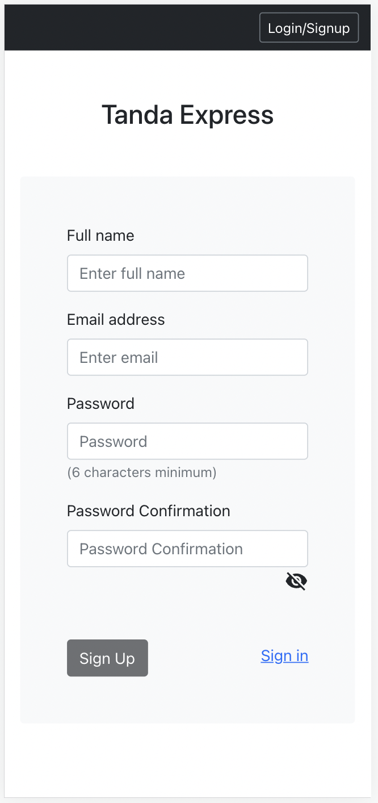
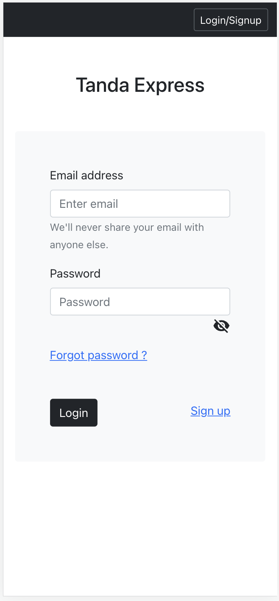
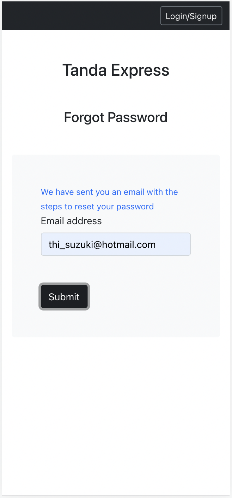
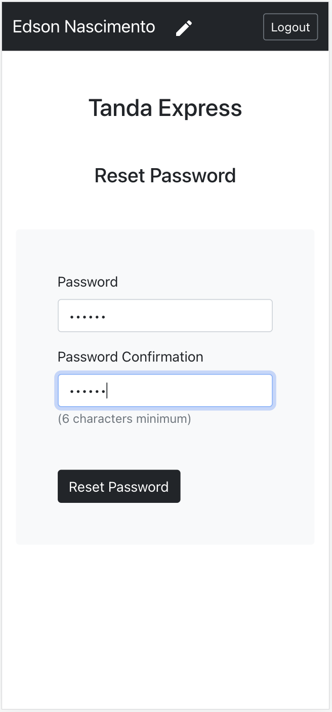
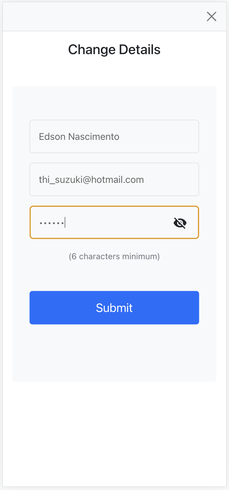  
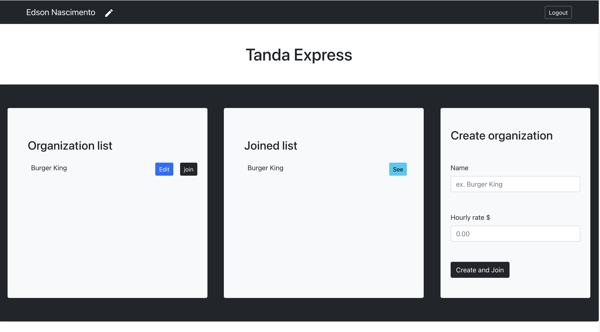  
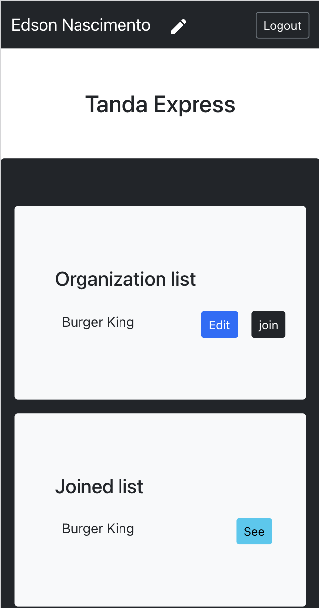  
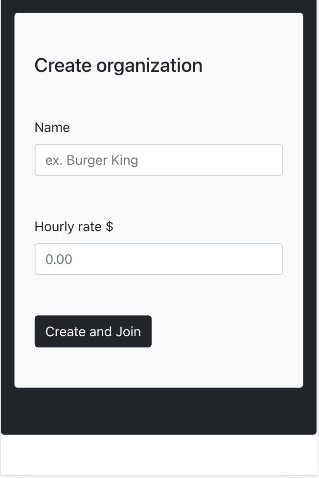  
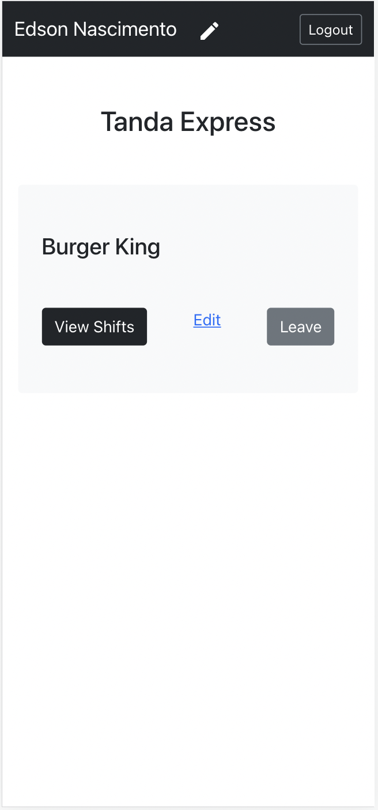
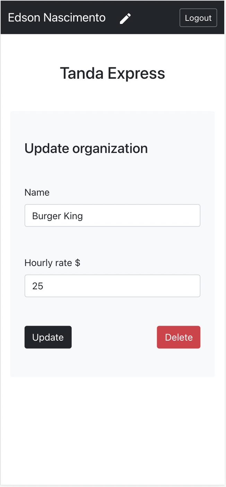
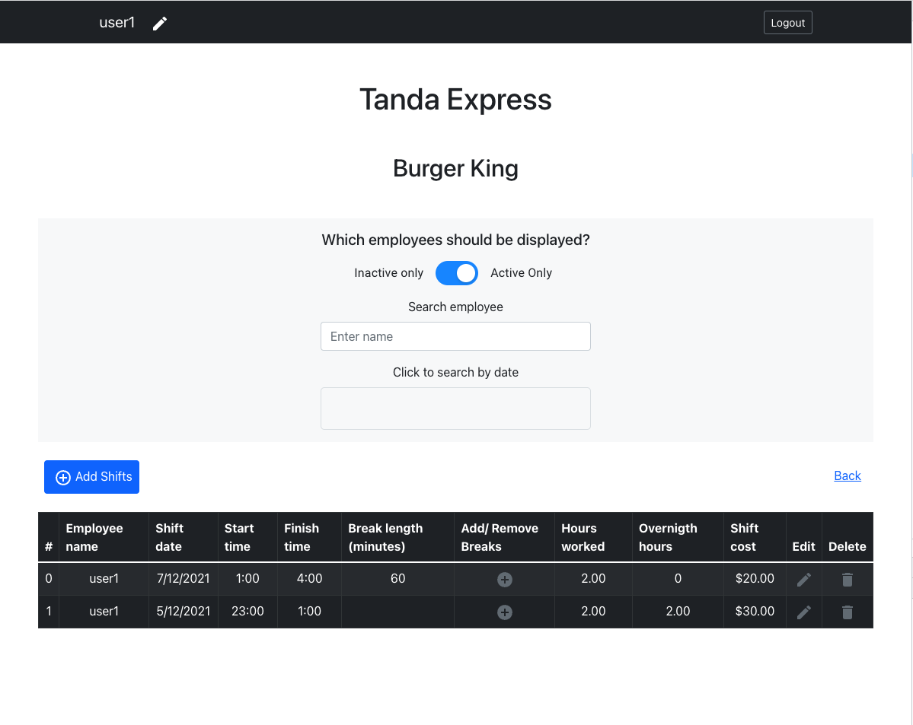  
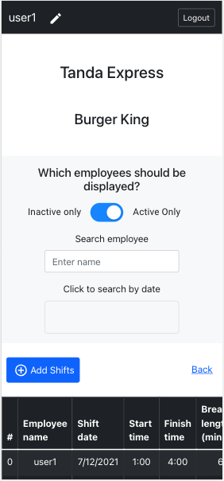  
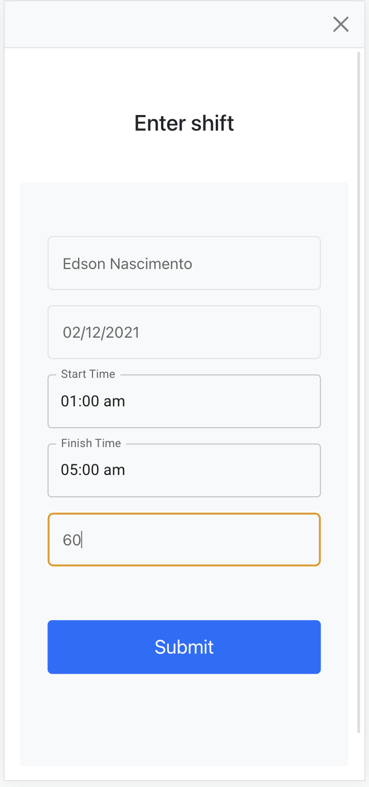
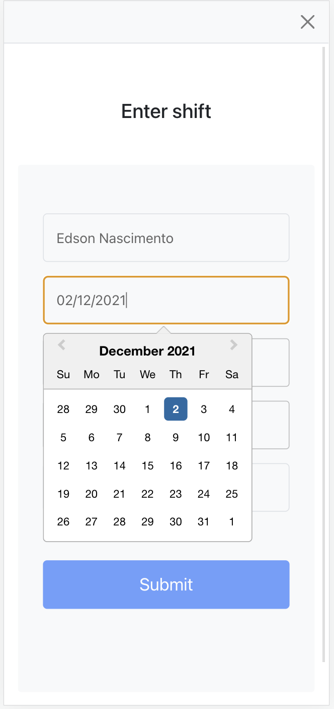
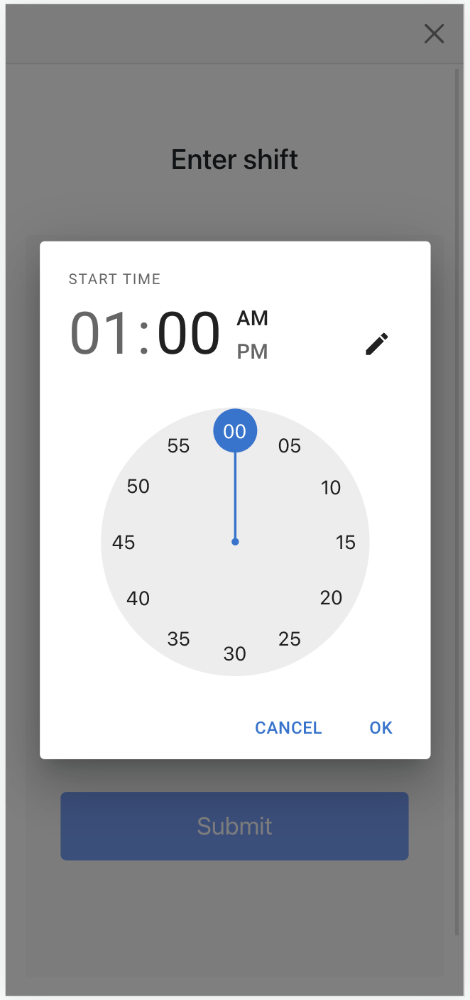  
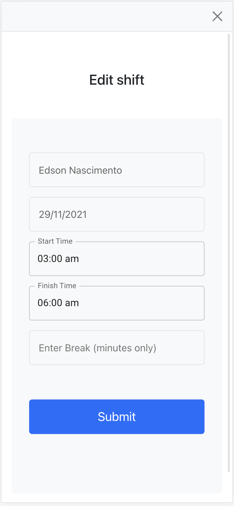  
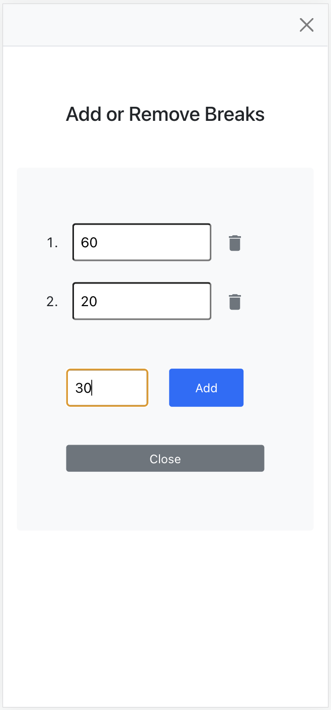

