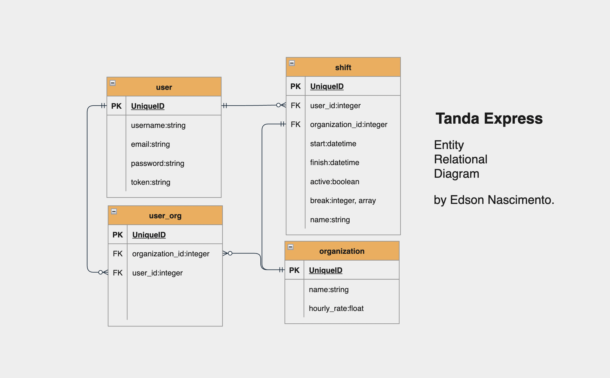
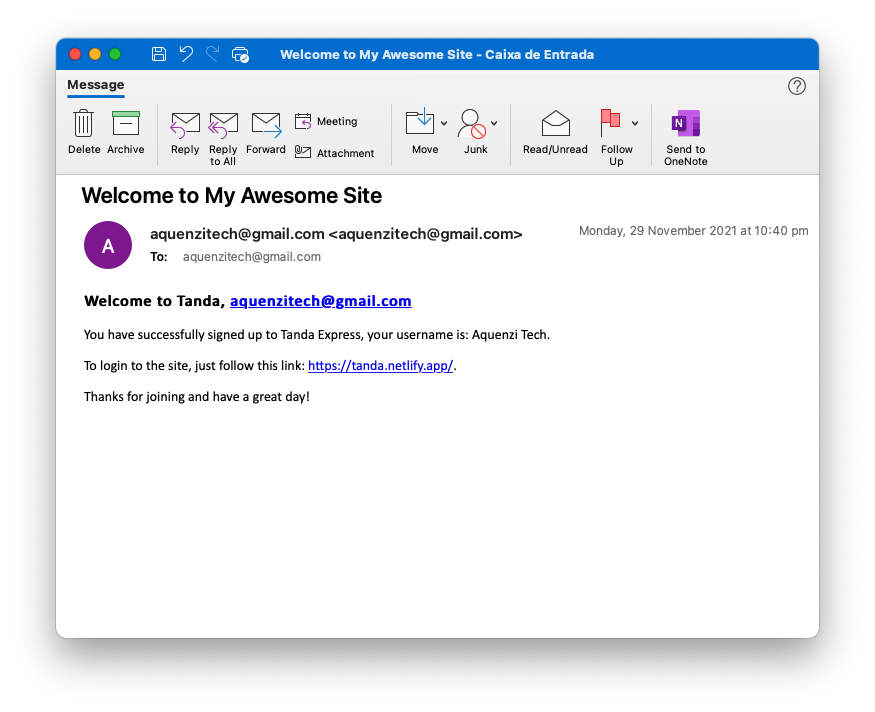
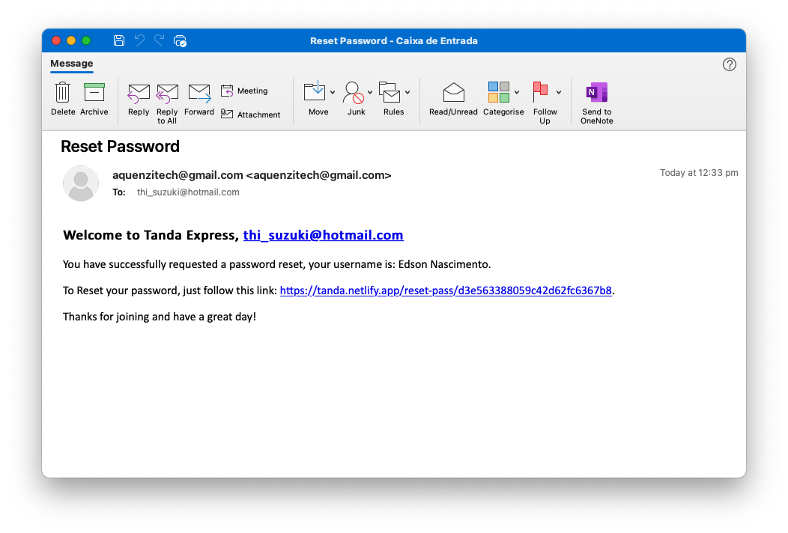

# TANDA CHALLENGE
This challenge is to create a highly simplified version of the Tanda web app from scratch using Ruby on Rails, Javascript and PostgreSQL.  

---

## Features
* Login, signup, forgot password, reset password features.  
* Organizations management.  
* Shifts and breaks management.  
* Allow users to change their own name, email address, or password.  
* Allow users to modify or delete existing shifts.  
* A table of prior employees shifts (inactive users table).  
* Allow users to filter which shifts are visible based on employee or a date range or both.  
* When creating a shift, if the finish time of a shift is earlier than the start time, the shift is considered overnight.   
* The hourly rate is doubled for shifts worked on a Sunday.   
* People often take more than one break when they work. For this project, instead of a shift having a single break length, it could have multiple.  
* Users to belong to more than one organisation. 
* Datepicker and Timepicker components.  
* Filter and sorting.  
* React SPA. 
* Welcome email sent to new users
* Reset password link sent to users when a forgot password is claimed.   

---  

## Testing
- RSPEC - backend API - Run the test using the command ```rspec``` on the API root folder, in the terminal.  
- Jest - frontend - Run the test using the command ```npm run test``` on the client root folder, in the terminal.  

---  

## Teck Stack
* Ruby on Rails - backend
* ReactJs - Frontend 
* PostgreSQL - database  

---

## Deployment and Hosting
- Api hosted deployed and Hosted on Heroku
- Client hosted and deployed on Netlify  

---

## WEBSITE  https://tanda.netlify.app/  

---

## REPO Backend API - https://github.com/Kryptic2020/Tanda-API    
--- 
## REPO Client - https://github.com/Kryptic2020/Tanda-Client    
---

## Third party APIs
* Sendgrid Email API  
---

## Management tools and Metodology
* Git & Github with more than 30commits, +8 branchs
* Agile - short sprints
* Trello cards 
  

---

## Testing
* RSPEC 
* JEST  

---

## Frameworks, gems and Packages
* Figaro
* Bcrypt
* Knock
* Bootstrap
* Styled Component
* "@date-io/date-fns": "^2.11.0",
* "@emotion/react": "^11.7.0",
* "@emotion/styled": "^11.6.0",
* "@mui/icons-material": "^5.2.0",
* "@mui/lab": "^5.0.0-alpha.57",
* "@mui/material": "^5.2.1",
* "@testing-library/jest-dom": "^5.11.4",
* "@testing-library/react": "^11.1.0",
* "@testing-library/user-event": "^12.1.10",
* "axios": "^0.24.0",
* "bootstrap": "^5.1.3",
* "date-fns": "^2.26.0",
* "react": "^17.0.2",
* "react-bootstrap": "^2.0.2",
* "react-datepicker": "^4.3.0",
* "react-dom": "^17.0.2",
* "react-router-dom": "^5.2.0",
* "react-scripts": "4.0.3",
* "styled-components": "^5.3.3",
* "web-vitals": "^1.0.1"  

---

## Tanda Sitemap  

  

---

## Tanda ERD  

    


---

## Tanda Screen shots  


  
  
  
  


  
  


  
  
  
  
  

